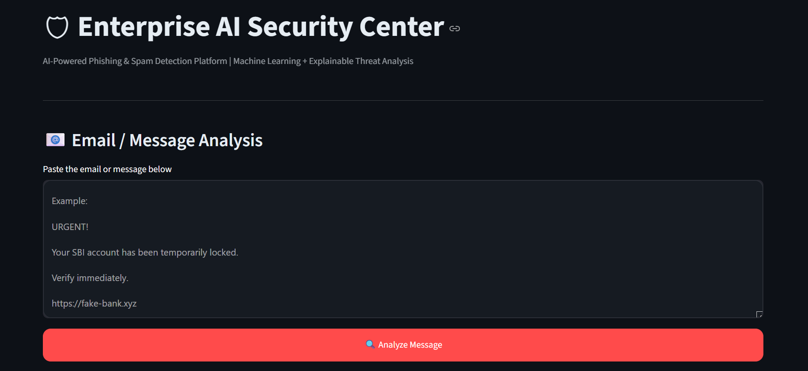
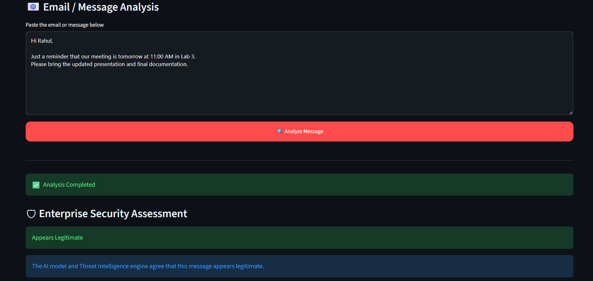
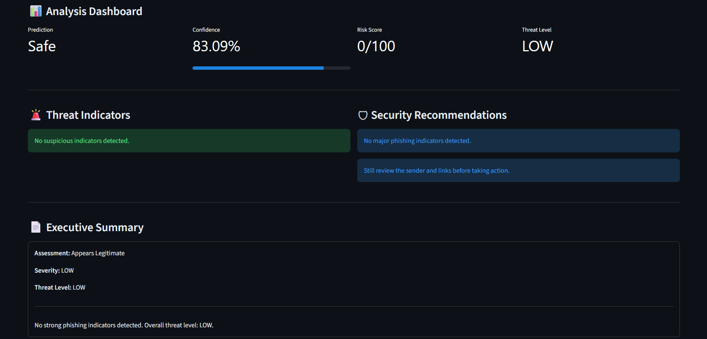
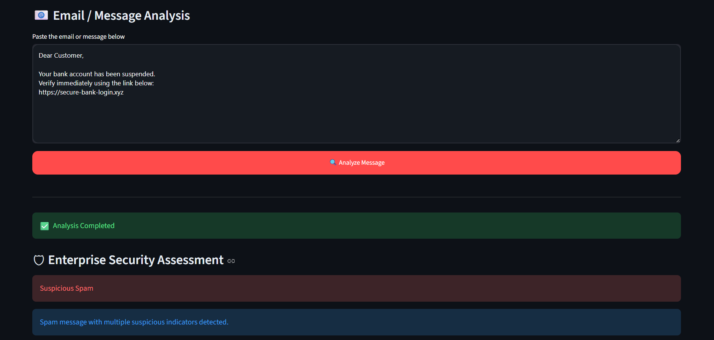
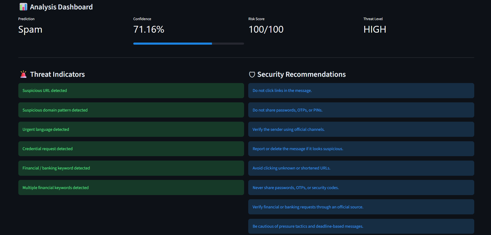
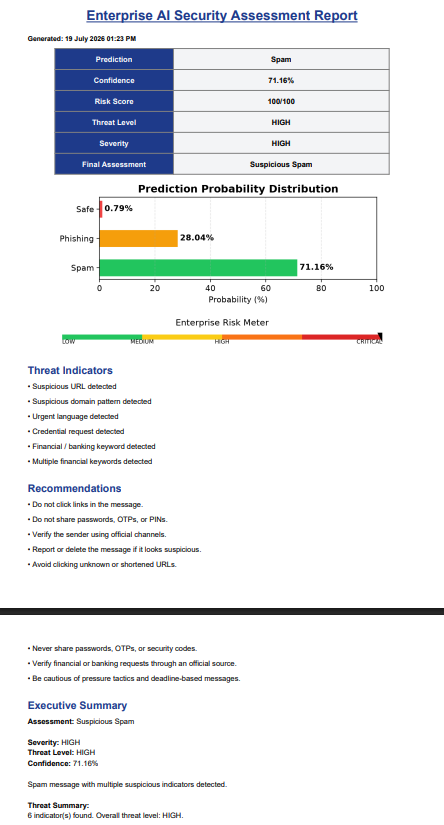

# 🛡️ Enterprise AI-Powered Phishing & Spam Detection System

<p align="center">
  <b>Intelligent Email Security using Natural Language Processing, Machine Learning, and Rule-Based Threat Intelligence</b>
</p>

<p align="center">
  
  
  
  
  
</p>

---

## 📌 Overview

This project is an **enterprise-inspired cybersecurity application** that analyzes emails/messages and classifies them into **Safe, Spam, and Phishing**. It combines:

- **Machine Learning** for text classification
- **Rule-Based Threat Intelligence** for security indicators
- **Enterprise Decision Logic** for final assessment
- **Streamlit UI** for interactive analysis
- **PDF Report Generation** for professional output

Unlike a simple spam filter, this system is designed to behave more like a **real security product**: it does not just predict a label; it also explains *why* the message was flagged, assigns a risk score, and generates actionable recommendations.

---

## ✨ Key Features

- 🧠 **3-class classification**: Safe / Spam / Phishing
- ⚠️ **Threat analyzer** with URL, credential, urgency, and financial keyword detection
- 🎯 **Enterprise decision engine** for final security assessment
- 📊 **Confidence and risk score** display
- 🛡️ **Threat level** mapping: Low / Medium / High / Critical
- 📋 **Threat indicators** and **security recommendations**
- 📝 **Executive summary** for human-readable interpretation
- 🌐 **Modern Streamlit dashboard**
- 📄 **Professional PDF report export**
- 🧪 **Test cases** for safe, spam, phishing, and confusing edge cases
- 💾 **Saved inference pipeline** for reproducible deployment
- 🧰 **Modular codebase** with clean separation of concerns

---

## 🏗️ System Architecture

```text
User Message
    │
    ▼
Preprocessing
    │
    ▼
Machine Learning Model
    │
    ▼
Threat Analyzer
    │
    ▼
Decision Engine
    │
    ▼
Enterprise Report
    │
    ▼
Streamlit Dashboard
    │
    ▼
PDF Export
```

---

## 🔁 End-to-End Workflow

1. User enters an email or message.
2. The ML model predicts **Safe / Spam / Phishing**.
3. The threat engine detects suspicious indicators.
4. The decision engine merges ML and threat signals.
5. The dashboard shows:
   - Prediction
   - Confidence
   - Risk score
   - Threat level
   - Final assessment
   - Recommendations
6. A PDF report can be downloaded for review or submission.

---

## 🧠 Tech Stack

| Category | Technologies |
|---|---|
| Language | Python |
| Machine Learning | Scikit-learn |
| NLP | TF-IDF Vectorizer |
| Data Handling | Pandas, NumPy |
| Visualization | Matplotlib |
| UI | Streamlit |
| PDF | ReportLab |
| Serialization | Joblib |
| Testing | Pytest |

---

## 📂 Project Structure

```text
CyberSec_Final_Project/
├── app/
│   ├── streamlit_app.py
│   ├── pdf_generator.py
│   ├── ui_helpers.py
│   └── styles.py
├── backend/
├── data/
│   ├── raw/
│   └── processed/
├── models/
├── notebooks/
├── scripts/
├── src/
├── tests/
├── visualizations/
├── DATASET_NOTES.md
├── PROJECT_LOG.md
├── requirements.txt
└── README.md
```

---

## 📊 Dataset

### Dataset Used
**The Biggest Spam Ham Phish Email Dataset (250000+)**

- Source: Kaggle
- Mirror: Hugging Face
- Development format: Parquet shards
- Rows processed: **365,448**
- Columns: `label`, `text`

### Label Mapping

| Raw Label | Meaning | App Label |
|---:|---|---|
| `0` | Ham / legitimate message | Safe |
| `1` | Phishing message | Phishing |
| `2` | Spam | Spam |

### Class Balance

| Class | Records | Share |
|---|---:|---:|
| Safe | 168,455 | 46.095477% |
| Phishing | 42,845 | 11.723966% |
| Spam | 154,148 | 42.180556% |

**Important:** Phishing is the minority class, so stratified splitting and phishing-focused evaluation were necessary.

---

## 🧹 Data Quality Highlights

- Missing text values were handled
- Duplicate rows were analyzed and documented
- Conflicting label-text groups were inspected
- Text length distribution was highly skewed
- Extreme long-message outliers were documented

For more detail, see `DATASET_NOTES.md`.

---

## 🔧 Preprocessing Strategy

The preprocessing pipeline preserves phishing-relevant signals instead of removing them too aggressively.

Implemented handling includes:

- HTML removal
- URL preservation as explicit tokens
- Email preservation as explicit tokens
- Numeric normalization
- Punctuation cleanup
- Stopword removal
- Porter stemming
- Unicode-safe processing
- Missing input handling

This helps the model learn from patterns like:

- suspicious URLs
- urgency language
- account-related keywords
- email/domain references
- number-heavy requests

---

## 🤖 Models Trained

Three classifiers were compared on the same TF-IDF feature space:

- Multinomial Naive Bayes
- Logistic Regression
- Random Forest

### Best Model Selected
**Logistic Regression**

It achieved the strongest balance between:
- accuracy
- macro F1
- phishing precision
- phishing recall
- phishing F1

---

## 📈 Model Performance

| Model | Accuracy | Macro F1 | Weighted F1 | Phishing Precision | Phishing Recall | Phishing F1 |
|---|---:|---:|---:|---:|---:|---:|
| Multinomial Naive Bayes | 91.58% | 0.8893 | 0.9139 | 0.8921 | 0.7366 | 0.8069 |
| **Logistic Regression** | **94.86%** | **0.9377** | **0.9489** | **0.8682** | **0.9355** | **0.9006** |
| Random Forest | 91.29% | 0.9036 | 0.9136 | 0.8649 | 0.8781 | 0.8715 |

---

## 🔐 Threat Intelligence Logic

The threat analyzer detects:

- Suspicious URLs
- Multiple URLs
- Email addresses
- Urgent language
- Credential requests
- Financial / banking terms
- Excessive punctuation / capitalization

The decision engine combines these results with the ML prediction to produce a final enterprise assessment such as:

- Appears Legitimate
- Likely Spam
- Suspicious Spam
- Possible False Positive
- Suspicious Message
- High Confidence Threat
- Critical Threat

---

## 📷 Application Screenshots

### 🏠 Dashboard


### ✅ Safe Message Input


### 🛡️ Safe Analysis Result


### ⚠️ Phishing Message Input


### 🚨 Phishing Analysis Result


### 📄 Generated PDF Report



## 🚀 Installation

```bash
git clone <repository-url>
cd CyberSec_Final_Project

pip install -r requirements.txt
```

---

## ▶️ Running the Project

### 1) Train and generate artifacts
```bash
python scripts/run_days_3_6.py
```

### 2) Launch the Streamlit app
```bash
streamlit run app/streamlit_app.py
```

---

## 🧪 Example Test Cases

### Safe
```text
Hi Rahul,

Just a reminder that our meeting is tomorrow at 11:00 AM in Lab 3.
Please bring the updated presentation and final documentation.
```

### Spam
```text
Congratulations!!

You have won a FREE iPhone and a shopping voucher.
Offer expires today.
Click now to claim your reward.
```

### Phishing
```text
Dear Customer,

Your bank account has been suspended.
Verify immediately using the link below:
https://secure-bank-login.xyz
```

### Confusing Edge Case
```text
Dear Customer,

We noticed unusual activity on your account.
Please do not click links in suspicious emails.
Open your banking app directly or type the official website manually.
```

---

## 📌 Why This Project Stands Out

This is not just a basic spam classifier.

It is designed to be:

- **three-class**
- **phishing-aware**
- **modular**
- **reproducible**
- **evaluation-driven**
- **portfolio-friendly**
- **presentation-ready**

That makes it much stronger than a standard tutorial project.

---

## 📚 Project Documentation

- `PROJECT_LOG.md` — day-by-day development log
- `DATASET_NOTES.md` — source, label mapping, data quality, and engineering decisions

---

## 🔮 Future Scope

- BERT / Transformer-based classifier
- Explainable AI with SHAP/LIME
- URL reputation APIs
- Attachment scanning
- Browser extension
- Multi-language support
- Real-time email integration
- Deployment on Streamlit Cloud

---

## 👨‍💻 Author

**Your Name Here**

- GitHub: `https://github.com/Dipto2611`
- LinkedIn: `https://www.linkedin.com/in/dipto26`
- Email: `diptaraj.ch.26@gmail.com`

---

## 📜 License

Developed for educational and academic purposes.

---

## ⭐ Final Note

This repository follows a clean ML pipeline pattern:
raw data → preprocessing → TF-IDF → model training → evaluation → saved pipeline → threat intelligence → enterprise dashboard → PDF report.

That makes it easy to test, explain, extend, and present professionally.
