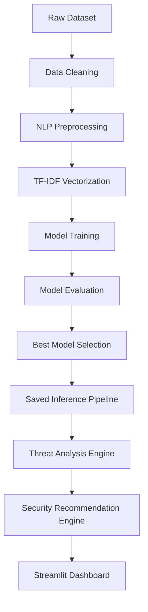
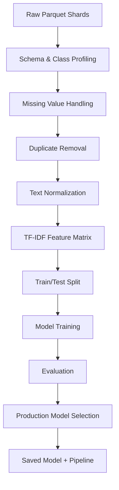

# 🛡️ Enterprise AI-Powered Phishing & Spam Detection System

> **Intelligent Email Security using Natural Language Processing and Machine Learning**


---

## 📌 Overview

This project is an end-to-end cybersecurity and machine learning application for classifying emails/messages into **Safe**, **Spam**, and **Phishing** categories.

The goal is not only to predict the label, but also to build a **professional, reproducible, and explainable ML pipeline** that can later be wrapped inside a Streamlit dashboard and extended with threat analysis and security recommendations.

The project was designed with a modular architecture so that every stage can be tested, audited, and improved independently:

- **Data profiling** to understand the source corpus
- **Data cleaning** to handle duplicates, missing values, and label consistency
- **NLP preprocessing** to normalize raw text while preserving security-relevant signals
- **TF-IDF feature engineering** for sparse text representation
- **Model comparison** across multiple classifiers
- **Automatic model selection** based on phishing-focused metrics
- **Saved inference pipeline** for reliable deployment later

---

## 🎯 Project Goals

- Detect Safe, Spam, and Phishing messages.
- Preserve phishing-specific signals such as URLs, emails, numbers, and urgency language.
- Compare multiple machine learning algorithms fairly.
- Select the best production model using measurable criteria.
- Save a reusable inference pipeline for future deployment.
- Document every important engineering decision.
- Build a GitHub-ready portfolio project suitable for internship review and technical interviews.

---

## ✨ Implemented Features

### ✅ Completed (Days 1–6)

- Project structure and environment setup
- Git repository initialization
- Dataset profiling and documentation
- Exact CSV/Parquet equivalence verification
- Data cleaning pipeline
- Reusable NLP preprocessing transformer
- Stratified development sampling strategy
- TF-IDF vectorization
- Training and comparison of three models:
  - Multinomial Naive Bayes
  - Logistic Regression
  - Random Forest
- Per-class evaluation metrics
- Confusion matrix generation
- False-negative inspection for phishing messages
- Saved model artifact generation
- Saved TF-IDF vectorizer
- Saved full inference pipeline
- Saved model metadata
- Testing for preprocessing edge cases

### 🚧 Planned (Days 7–10)

- Threat analysis engine
- Security recommendation engine
- Streamlit dashboard
- Confidence display / threat severity summary
- Final polish and presentation readiness

---

## 🏗️ System Architecture



---

## 🧠 Machine Learning Pipeline



---

## 📂 Repository Structure

```text
CyberSec_Final_Project/
├── .agents/
├── app/
├── data/
│   ├── raw/
│   └── processed/
├── models/
│   └── README.md
├── scripts/
├── src/
├── tests/
├── visualizations/
├── DATASET_NOTES.md
├── PROJECT_LOG.md
├── requirements.txt
└── README.md
```

---

## 📊 Dataset

### Dataset Used

**The Biggest Spam Ham Phish Email Dataset (250000+)**

- Source: Kaggle
- Mirror: Hugging Face
- Format used for development: Parquet shards
- Number of records: **365,448**
- Columns: `label`, `text`

### Label Mapping

| Raw Label | Meaning | Application Label |
|----------:|---------|-------------------|
| `0` | Ham / legitimate message | Safe |
| `1` | Phishing message | Phishing |
| `2` | Unsolicited spam | Spam |

### Class Balance

| Class | Records | Share |
|------|--------:|------:|
| Safe | 168,455 | 46.095477% |
| Phishing | 42,845 | 11.723966% |
| Spam | 154,148 | 42.180556% |

**Important:** Phishing is the minority class, so stratified splitting and phishing-focused evaluation are required.

---

## 🧹 Data Quality Highlights

- 2 missing text values
- 84,490 duplicate full rows
- 84,498 duplicate text values
- 8 conflicting text-label groups involving 20 rows
- Strong right-skew in message length
- Extreme outliers up to 11,510,306 characters

These issues were documented in detail in `DATASET_NOTES.md`.

---

## 🔧 Preprocessing Strategy

The preprocessing pipeline is designed to preserve security signals instead of stripping them away too aggressively.

### Implemented handling includes:

- HTML removal
- URL preservation as explicit tokens
- Email preservation as explicit tokens
- Numeric normalization
- Punctuation and symbol cleanup
- Stopword removal
- Porter stemming
- Unicode-safe processing
- Missing input handling

This ensures the model still learns from phishing-relevant patterns such as:
- suspicious URLs
- urgent language
- account-related keywords
- email/domain references
- number-heavy requests

---

## 🤖 Models Trained

Three classifiers were compared on the same TF-IDF feature space:

- **Multinomial Naive Bayes**
- **Logistic Regression**
- **Random Forest**

### Best Model Selected

**Logistic Regression**

It achieved the strongest balance between:
- accuracy
- macro F1
- phishing precision
- phishing recall
- phishing F1

---

## 📈 Model Performance

| Model | Accuracy | Macro F1 | Weighted F1 | Phishing Precision | Phishing Recall | Phishing F1 |
|------|----------:|---------:|------------:|-------------------:|----------------:|------------:|
| Multinomial Naive Bayes | 91.58% | 0.8893 | 0.9139 | 0.8921 | 0.7366 | 0.8069 |
| **Logistic Regression** | **94.86%** | **0.9377** | **0.9489** | **0.8682** | **0.9355** | **0.9006** |
| Random Forest | 91.29% | 0.9036 | 0.9136 | 0.8649 | 0.8781 | 0.8715 |

### Why Logistic Regression Won

It delivered the best overall balance, especially for the **phishing class**, which is the most important label in this project.

---

## 📁 Generated Artifacts

The training pipeline produces:

- `models/final_model.joblib`
- `models/tfidf_vectorizer.joblib`
- `models/final_pipeline.joblib`
- `models/model_metadata.joblib`

It also generates analysis outputs under `visualizations/`:

- `confusion_matrix.png`
- `model_comparison.csv`
- `model_metrics.json`
- `manual_predictions.json`
- `phishing_false_negatives.csv`

---

## 🧪 Testing

The preprocessing module is covered by lightweight tests for:

- empty strings
- missing input
- whitespace-only messages
- URLs
- email addresses
- numbers
- punctuation-only input
- mixed casing
- Unicode text
- realistic phishing messages

These tests help ensure the preprocessing logic remains stable and deterministic.

---

## 🚀 Installation

### 1. Clone the repository

```bash
git clone <repository-url>
cd CyberSec_Final_Project
```

### 2. Create and activate a virtual environment

#### Windows

```bash
python -m venv venv
venv\Scripts\activate
```

#### macOS / Linux

```bash
python3 -m venv venv
source venv/bin/activate
```

### 3. Install dependencies

```bash
pip install -r requirements.txt
```

### 4. Run the Day 3–6 training pipeline

```bash
python scripts/run_days_3_6.py
```

---

## 🖥️ How to Use

### Train the models and generate artifacts

```bash
python scripts/run_days_3_6.py
```

### Load the saved pipeline later

The saved inference pipeline is designed for future integration into the application layer.

---

## 📊 Outputs You Should Expect

After the training pipeline runs successfully, the repository should contain:

```text
models/
├── final_model.joblib
├── final_pipeline.joblib
├── model_metadata.joblib
└── tfidf_vectorizer.joblib

visualizations/
├── confusion_matrix.png
├── manual_predictions.json
├── model_comparison.csv
├── model_metrics.json
└── phishing_false_negatives.csv
```

---

## 🧩 Current Project Status

### Completed
- Day 1 — Project Foundation
- Day 2 — Dataset Profiling
- Day 3 — Data Cleaning & NLP Preprocessing
- Day 4 — Feature Engineering & Baseline Model
- Day 5 — Model Comparison & Selection
- Day 6 — Evaluation & Artifact Saving

### Remaining
- Day 7 — Threat Analyzer
- Day 8 — Recommendation Engine
- Day 9 — Streamlit Application
- Day 10 — Final Review, Documentation & Submission

---

## 🔮 Future Scope

Planned improvements after the current version:

- Threat indicator scoring
- Explainable AI keyword highlighting
- Confidence score display
- Email attachment scanning
- URL reputation checking
- Real-time web deployment
- Streamlit Cloud deployment
- Better visual analytics for phishing trends

---

## 💡 Why This Project Stands Out

This is not just a basic spam classifier.

It is designed to be:

- **three-class** instead of binary
- **phishing-aware**
- **modular**
- **reproducible**
- **evaluation-driven**
- **portfolio-friendly**
- **deployment-ready**

That makes it much more interesting than a standard tutorial project.

---

## 🧰 Tech Stack

- **Python**
- **Pandas**
- **NumPy**
- **Scikit-learn**
- **NLTK**
- **Matplotlib**
- **Joblib**
- **Streamlit** *(planned)*
- **Pytest**

---

## 📚 Project Documentation

- `PROJECT_LOG.md` — full day-by-day progress log
- `DATASET_NOTES.md` — source, label mapping, data quality, and engineering decisions

---

## 👨‍💻 Author

**Your Name Here**

- GitHub: `add-your-github-link`
- LinkedIn: `add-your-linkedin-link`
- Email: `add-your-email`

---

## 📜 License

This project is released under the **MIT License**.

---

## ⭐ Final Note

This repository follows a clean ML pipeline pattern: raw data → preprocessing → TF-IDF → model training → evaluation → saved pipeline. That makes it easy to test, explain, and extend into a full cybersecurity dashboard.

---

## 📌 Status Summary

**Days 1–6:** Complete  
**Days 7–10:** In progress
